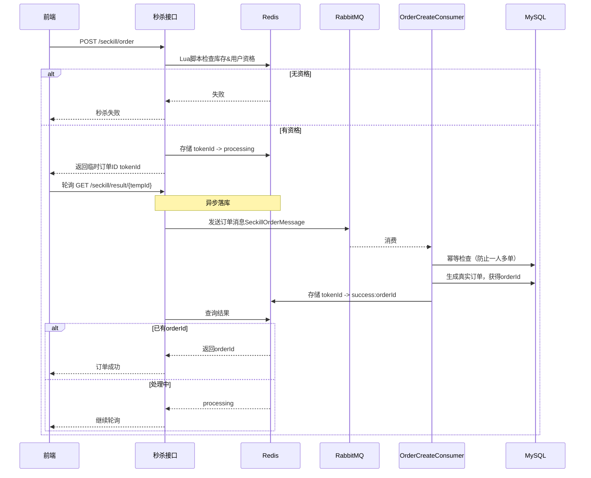
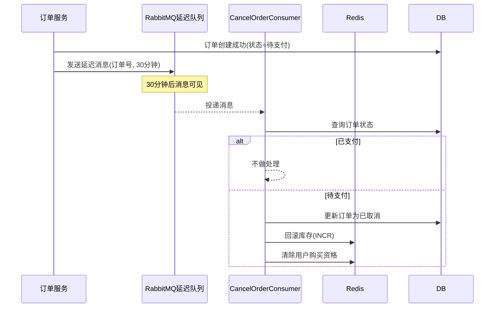

# 🔥 Seckill System – 电商秒杀系统

**基于 Spring Boot + Redis + RabbitMQ + MySQL 的电商秒杀系统**，支持 JWT 登录、购物车、商品收藏、分类，

并通过 **Lua脚本原子扣库存 + 异步消息队列落库 + 延迟队列取消订单** 实现高并发秒杀。

> JMeter 压测：秒杀接口吞吐量 **700+ TPS**

---

## 🧰 技术栈

| 技术 | 作用                  |
|------|---------------------|
| Spring Boot | 基础框架                |
| Redis | 库存预热、用户资格标记、临时订单ID  |
| RabbitMQ | 异步落库 + 延迟队列（订单超时取消） |
| MySQL | 订单/商品/购物车持久化        |
| MyBatis-Plus | ORM 简化 CRUD          |
| JWT | 用户认证                |

---

## ⚡ 秒杀核心流程

系统通过 **“先预检，后异步落库，前端轮询”** 的方式应对高并发。

### 1. 秒杀时序图

### 2. 关键步骤说明

| 步骤 | 描述                                     |
|------|----------------------------------------|
| ① Lua原子检查 | 一次性检查库存、用户是否重复下单，通过则扣库存并记录临时资格         |
| ② 返回临时ID | 生成 tokenId存入redis并立即返回前端，后续所有状态通过它查询   |
| ③ 异步落库 | 将订单消息推入 RabbitMQ，由消费者幂等建单（数据库唯一索引保证不重复） |
| ④ 结果回写 | 消费者写入真实 orderId 到 Redis，前端轮询获得最终结果     |

**为什么这样设计？**

- 秒杀接口只做内存操作（Lua + Redis），响应快
- 
- 数据库写操作被 MQ 削峰，避免崩溃
- 
- 前端轮询 Redis 极轻量，支持高 QPS

## 🥝订单超时取消（延迟队列）

用户秒杀成功但未支付，30分钟后自动回滚库存。

**幂等保障**：取消前再次检查订单状态，避免重复回滚。

## 🧪 JMeter 压测说明（不强制JWT）

- 线程组：300 线程 × 10 次循环（可根据机器调整，总请求 3000左右）
- HTTP请求：`POST /seckill/order`（其他信息在Body中传入）
- 请求头：`Content-Type: application/json`
- Body：`{"userId": ${__Random(1,10000,userId)}}`
- 聚合报告确认 **TPS ≈ 700+**

## ⚠️ 备注

- **务必修改 `application.yml` 中的数据库/Redis/RabbitMQ 地址**
- 
- **觉得不错就点个⭐吧**