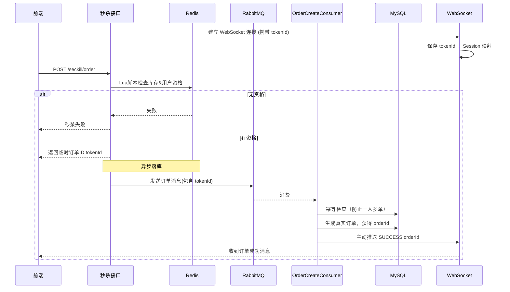
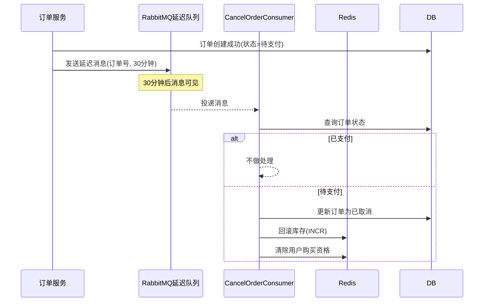

# 🔥 Seckill System – 电商秒杀系统

**基于 Spring Boot + Redis + RabbitMQ + MySQL + MyBatis-Plus 的电商秒杀系统**，支持 JWT 登录、购物车、商品收藏、分类，

并通过 **Lua脚本原子扣库存 + 异步消息队列落库 + 延迟队列取消订单 + WebSocket 实时推送** 实现高并发秒杀。

---

## 🧰 技术栈

| 技术 | 作用                  |
|------|---------------------|
| Spring Boot | 基础框架                |
| Redis | 库存预热、用户资格标记、临时订单ID  |
| RabbitMQ | 异步落库 + 延迟队列（订单超时取消） |
| MySQL | 订单/商品/购物车持久化        |
| MyBatis-Plus | ORM 简化 CRUD          |
| JWT | 用户认证                |

---

## ⚡ 秒杀核心流程

系统通过 **“先预检，后异步落库，WebSocket 推送结果”** 的方式应对高并发，避免轮询带来的服务器压力。

### 1. 秒杀时序图

### 2. 关键步骤说明

| 步骤 | 描述                                      |
|------|-----------------------------------------|
| ① Lua原子检查 | 一次性检查库存、用户是否重复下单，通过则扣库存并记录临时资格          |
| ② WebSocket 绑定 | 前端用 tokenId 建立 WebSocket 连接，后端保存会话映射      |
| ③ 异步落库 | 将订单消息推入 RabbitMQ，由消费者幂等建单（数据库唯一索引保证不重复） |
| ④ 结果推送 | 消费者生成真实 orderId 后，通过 WebSocket 主动推送给前端     |

**为什么这样设计？**

- 秒杀接口只做内存操作（Lua + Redis），响应快
- 
- 数据库写操作被 MQ 削峰，避免崩溃
- 
- WebSocket 推送替代轮询，降低服务器无效请求（轮询会产生大量查询），结果实时性更高
---

## 🥝订单超时取消（延迟队列）

用户秒杀成功但未支付，30分钟后自动回滚库存。

---

## 🧪 JMeter 压测说明（不强制JWT）

- 线程组：300 线程 × 10 次循环（可根据机器调整，总请求 3000左右）
- HTTP请求：`POST /seckill/order`（其他信息在Body中传入）
- 请求头：`Content-Type: application/json`
- Body：`{"userId": ${__Random(1,10000,userId)}}`
- 聚合报告确认 **QPS ≈ 600+**
- 注：压测时仅关注秒杀接口的吞吐量，WebSocket 推送性能可通过单独工具验证，通常不会成为瓶颈。
---

## ⚠️ 备注

- **务必修改 `application.yml` 中的数据库/Redis/RabbitMQ 的相关配置**
- 
- **觉得不错就点个⭐吧**